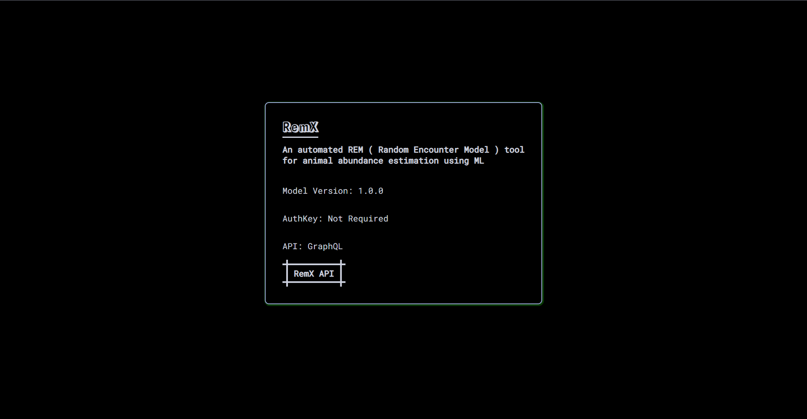

 

  

    
  

  

**Project Report** -> https://drive.google.com/file/d/1uf190dMKS53QddYgG-PH6x-7NyU5RKab/view?usp=drive_link

### This project is Created by team of
*Pranav T Selven*

*Atiq Urrahman*

*Vijay Joshi*

*Sahil Goyal*
  
API link - >http://ec2-13-49-46-41.eu-north-1.compute.amazonaws.com/docs
 
 
Web Site LInk To test Api -> https://remx-web-flask.onrender.com
  

## Related Repository
**Model Development Repo**-> https://github.com/Vijay-J0shi/remx_yolo
 
**Flask Website Development Repo**-> https://github.com/Vijay-J0shi/Remx_Web_Flask
 
**React Website Repo** (Developed By atiq and Adam) ->https://github.com/Adam-Al-Rahman/remx-website

 

[REMX API](https://github.com/Adam-Al-Rahman/remx-api) is an automated REM (Random Encounter Model) tool for animal abundance estimation using Machine Learning

  

    
  

 
  
### Overview
Remx is an innovative API designed to automate the detection and measurement of wildlife in India, integrated as a component of the Animeter application used by Wildlife India. The project leverages motion-sensing cameras placed in wildlife habitats to capture thousands of images triggered by animal presence. These images are processed to identify animals and generate bounding boxes around them, enabling precise measurements based on a pixel-to-distance ratio. Traditionally, this process required manual annotation of bounding boxes across vast datasets, a labor-intensive and time-consuming task. Remx automates this process using a YOLOv8-based deep learning model, delivering accurate bounding box predictions through a RESTful API. This API is designed for seamless integration into the Animeter software, developed by a senior team, to enhance wildlife monitoring and conservation efforts.

### Purpose
The primary purpose of Remx is to streamline the process of wildlife monitoring by automating the detection and measurement of animals in images captured by motion-sensing cameras. By providing an API that predicts bounding boxes around animals, Remx eliminates the need for manual annotation, significantly reducing the workload for wildlife researchers and conservationists. The project aims to:
- Enhance the efficiency of data processing for wildlife monitoring.
- Provide accurate and reliable bounding box predictions for animal measurements.
- Support conservation efforts by enabling scalable analysis of wildlife populations and behaviors.
- Integrate seamlessly with the Animeter application to provide a robust tool for Wildlife India.

### Product Functions

- **Model Training**: Fine-tunes a YOLOv8 model and exports it to ONNX for deployment.
- **Image Processing**: Accepts single images or ZIP files, preprocesses them, and predicts bounding box coordinates using YOLOv8.
- **API Endpoints**: Provides a RESTful endpoint (/api/predict/upload) for uploading files and returning predictions.
- **Web Interface**: Enables users to upload files, view predictions, download CSV results, and access historical data.
- **Data Persistence**: Stores prediction results in a SQLite database for historical analysis.
- **CI/CD Pipelines**: Automates testing, linting, and deployment for both API and web application.

## 
License

REMX API offers two licensing options to accommodate diverse use cases:

- **GPL-3.0 Licence**: This [OSI-approved](https://opensource.org/licenses/) open-source license is ideal for students and enthusiasts, promoting open collaboration and knowledge sharing. See the [GPL-3 License](https://github.com/Adam-Al-Rahman/remx-api/blob/main/LICENSE) file for more details.

